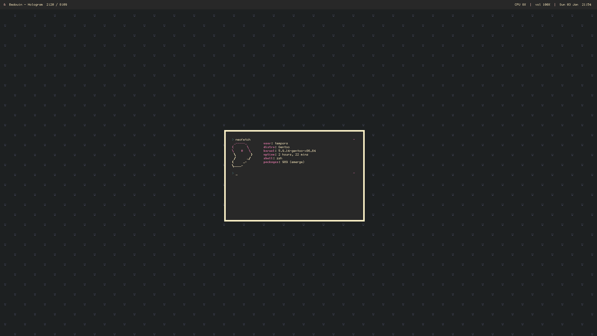

  <h1>dots.</h1>
These are my current dotfiles.

	<h3>replicating</h3>
Most paths are currently defined as absolute paths, so you will likely need to change around a few things.
[font](https://github.com/Lucy/tewi-font)

### packages.  
Gentoo   `emerge -a nitrogen alacritty termsyn polybar xmonad xmonad-contrib picom dmenu`    
Arch   `yay -S nitrogen alacritty misc-termsyn polybar xmonad xmonad-contrib picom dmenu`

